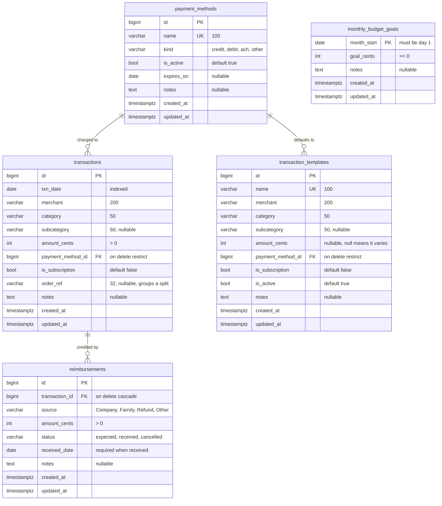

# Database Schema

Source of truth is the ORM models inside `src/`, this diagram is generated by an LLM.

## Things the diagram cannot show

- `monthly_budget_goals` deliberately has no foreign keys, since a goal belongs to a month rather
  than to any particular transaction. Summaries join the two by date range at query time.
- `transaction_templates` has no link to `transactions` in either direction. A template only fills
  in a form, so editing one never rewrites anything already recorded.
- `order_ref` is a plain string rather than a foreign key. A split is just several sibling rows that
  happen to share the value, and with no parent row there is no stored total that can disagree with
  the rows underneath it.
- Enums are stored as `varchar` with a `CHECK` constraint. Native Postgres enums can gain values
  easily but cannot drop or reorder them without a migration dance.
- Deleting a payment method that still has history is blocked by `RESTRICT`, while deleting a
  transaction takes its reimbursements with it through `CASCADE`.

## Editing it (non-LLM)

When editing the schema by hand, the mermaid block renders on GitHub and in most editors such as
the VSCode preview extension, and it sits close enough to the code to be updated in the same commit
as the migration that changed things.

For a prettier or hand-arranged version, draw.io imports the block directly through
**Arrange > Insert > Advanced > Mermaid**. Treat whatever comes out as an export rather than a
second copy to maintain, or the two will drift apart.
